# ServicePlus
## Welcome
Bem-vindo ao portifólio ServicePlus, esperamos que você possa abstrair tanto conhecimento quanto agregar. 

Somos desenvolvedores entusiastas e loucos por inovação. 

Esse projeto foi criado com a expectativa de atender a necessidade de diversas pessoas que estão em busca de uma colocação no mercado para serviços domésticos, quanto 
clientes que necessitam de um atendimento eficaz e seguro. 

Nós temos orgulho de olhar para trás e ver o quanto evoluímos com a construção desse projeto e sentir o anseio da melhoria e evolução constante. 

Agradecemos pelo bug de cada dia, que nos inspira a continuarmos em nossa missão. 

## Como iniciar o projeto

Instale todas as dependências:
````bash
npm install
````
💡 Inicie seu servidor MySQL (XAMPP recomendado) na porta 3306 

Crie o banco de dados com `sequelize`
````bash
npx sequelize db:create
````
Crie as tabelas do banco de dados com `sequelize`
````bash
npx sequelize db:migrate
````
Rode todas as seeders para inserir os valores iniciais do banco de dados
````bash
npx sequelize db:seed:all
````
Após realizar todos os processos anteriores, faça
````bash
npm start
````

## Um pouco mais sobre o projeto
### Pagina inicial
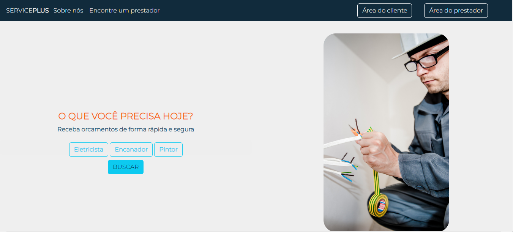

### Lista de profissionais
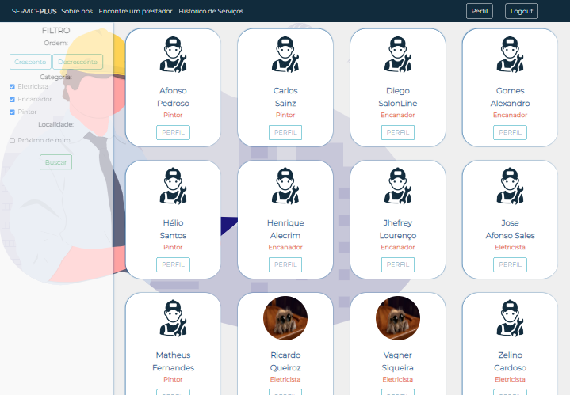

### Solicitar orçamento
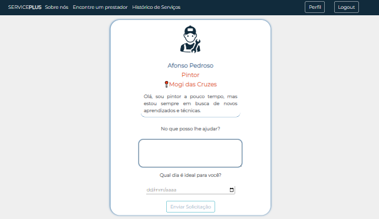

### Login
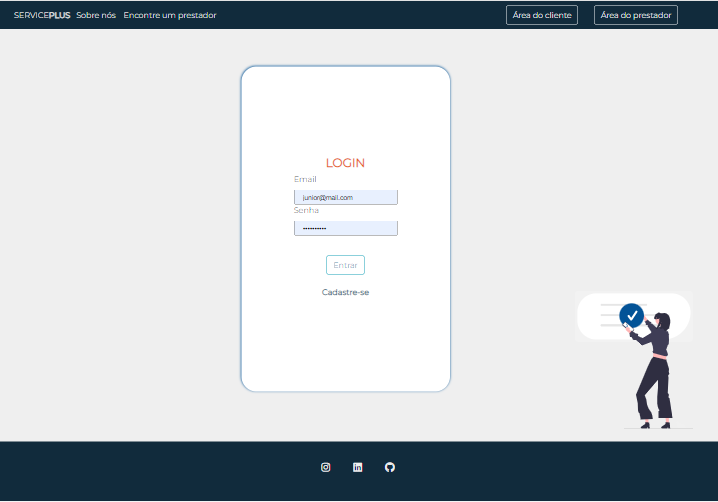

### Cadastro 
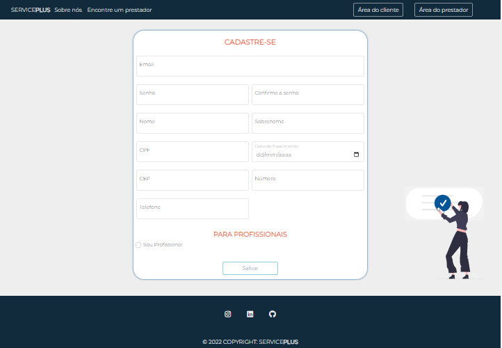

### Perfil do cliente 
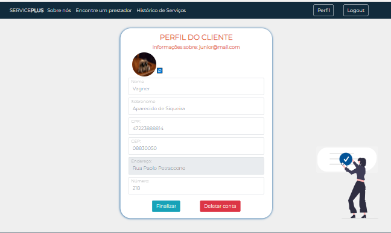

### Perfil do profissional
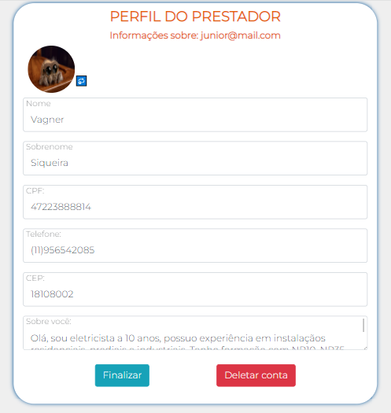

### Histórico de serviços do cliente
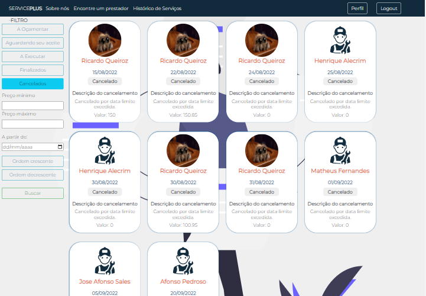
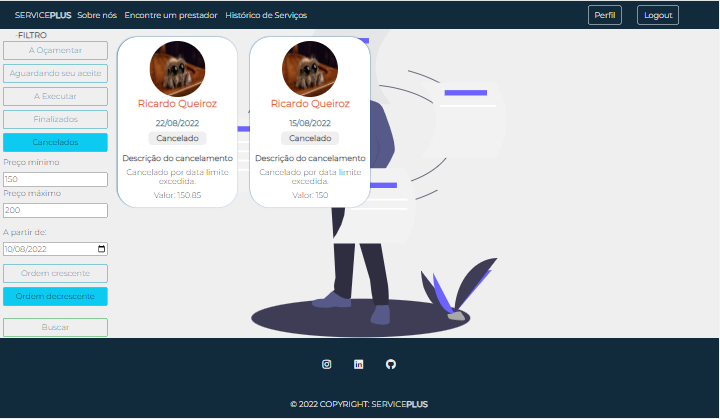

### Histórico de serviços do profissional
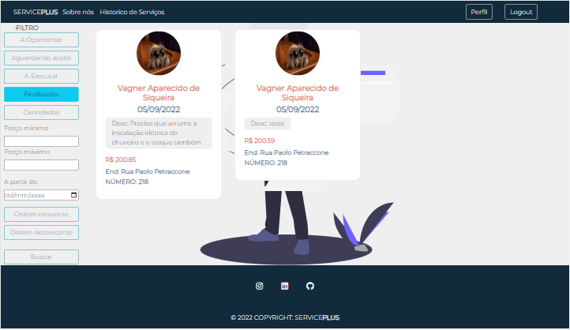

### Sobre nós
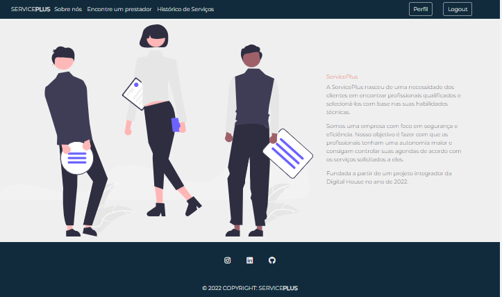

## Agradecimentos
Agradecemos a Digital House e aos professores que colaboraram com nossa evolução e conhecimento. 

Inicialmente esse projeto era para ser um e-commercer, mas decidimos nos desafiar e fazer algo além do proposto pelo curso. 

Chegamos nesse projeto final para essa estrutura monolítica, mas já temos proposta futuras para a “refatoração” e utilizar novas tecnologias para a criação de um projeto mais maduro, segue o github: https://github.com/jrbigmon/ServicePlusApi  

A vida é baseada em constantes evoluções, tropeços e erros. No mundo da programação, isso se repede com mais frequência do que imaginamos, mas nós, programadores em ascensão, sabemos que a resiliência é a chave para o sucesso. 

- “Insanidade é: fazer a mesma coisa várias vezes e esperar resultados diferentes” 
Albert Einstein 
